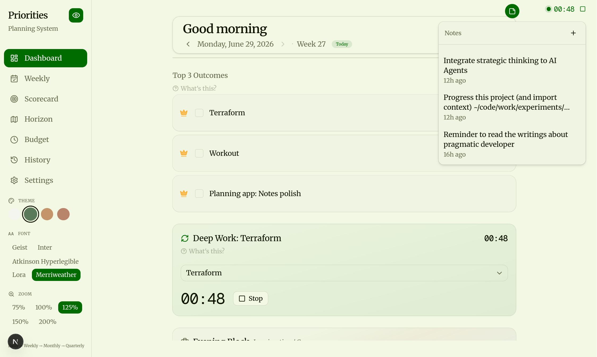
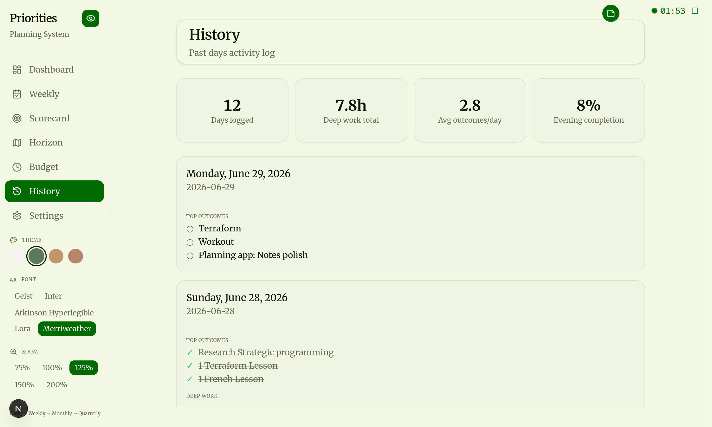
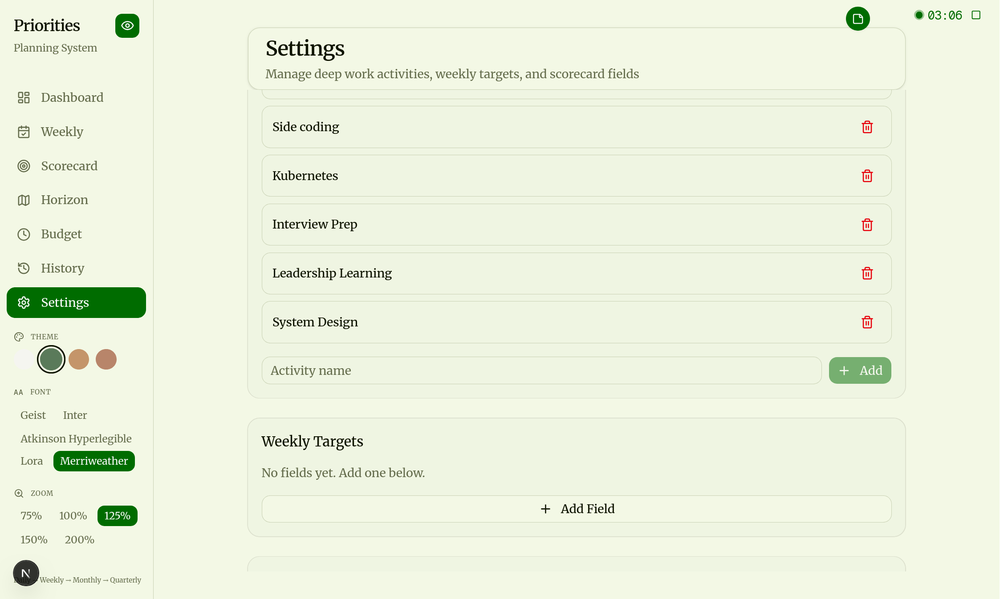

# Dayflow

A personal planning system — daily, weekly, and strategic.

Track your 3 key outcomes each day, log deep work sessions, review evenings, keep score, and zoom out to the big picture. Built for clarity, not complexity.

## What Is Dayflow?

Dayflow is a personal planning app that helps you stay focused on what matters. Each day you set 3 key outcomes, track deep work sessions with a timer, and end with an evening review. Zoom out to weekly, monthly, and quarterly views to keep the big picture in sight.

## Features

### Daily Dashboard
Plan your day: set 3 outcomes, drag to reorder, mark complete. Log deep work sessions with one-click timing. Evening review + "protection gate" to record what you said no to.



### History
Browse past entries, review completed outcomes, and see your deep work sessions. Edit or delete sessions as needed.



### Settings
Customize your experience — themes, fonts, view modes (basic/full), and app-wide scaling.



### More features
- **Weekly View** — See your week at a glance, track time across categories.
- **Horizon** — Monthly & quarterly planning. Strategic alignment beyond the day.
- **Scorecard** — Visual metrics and trends. Charts for outcomes, deep work, skill sessions, and time allocation.
- **Budget** — Track spending against your plan.

## Quick Start

```bash
pnpm install
pnpm dev
```

Open [http://localhost:3000](http://localhost:3000).

No external setup needed — the app uses a local SQLite file (`data.db`).

---

<details>
<summary><b>For Developers</b></summary>

### Tech Stack

| Layer | Choice |
|-------|--------|
| Framework | Next.js 16 (React 19) |
| Styling | Tailwind CSS v4 |
| UI | shadcn/ui + Base UI + Framer Motion |
| Database | SQLite via libSQL (Turso-compatible) |
| ORM | Drizzle with drizzle-kit migrations |
| Package Manager | pnpm |

### Setup

#### Prerequisites
- Node.js 20+
- pnpm

#### Database

```bash
# Generate migrations from schema
pnpm db:generate

# Push schema to SQLite
pnpm db:push

# Open Drizzle Studio (GUI)
pnpm db:studio
```

#### Docker

```bash
docker compose up -d
# Runs on port 3001
```

### Project Structure

```
src/
├── app/          # Next.js App Router pages
│   ├── budget/
│   ├── history/
│   ├── horizon/
│   ├── scorecard/
│   ├── settings/
│   └── weekly/
├── components/   # React components
│   ├── dashboard/
│   └── ui/
└── lib/          # Actions, DB, stores, utilities
```

### Scripts

| Command | Description |
|---------|-------------|
| `pnpm dev` | Start dev server |
| `pnpm build` | Production build |
| `pnpm start` | Start production server |
| `pnpm lint` | Run ESLint |
| `pnpm db:push` | Push schema to DB |
| `pnpm db:studio` | Open Drizzle Studio |
| `pnpm db:migrate` | Run migrations |

</details>
